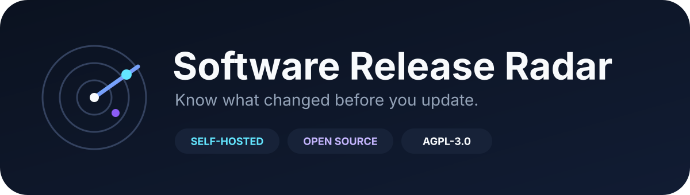
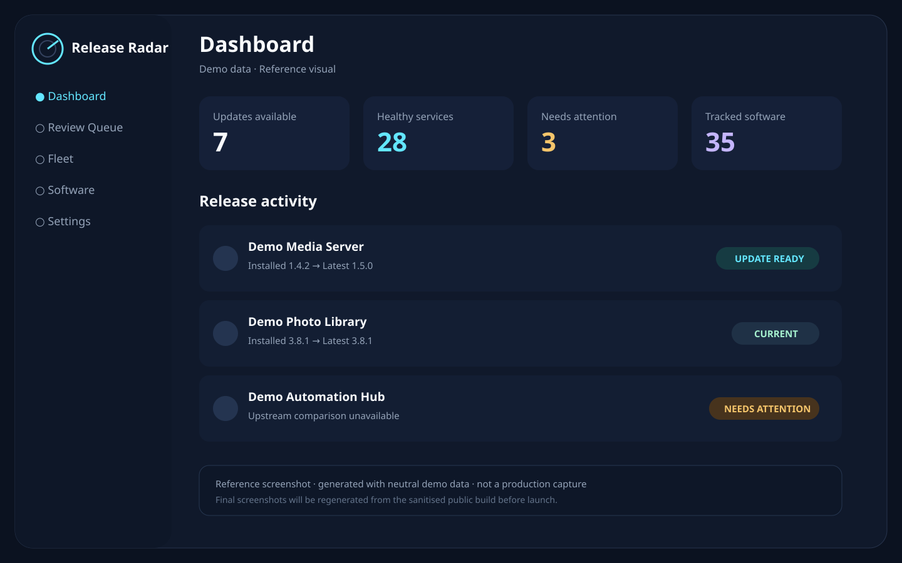
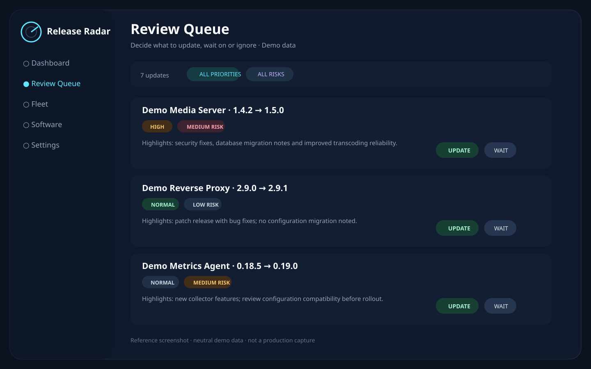
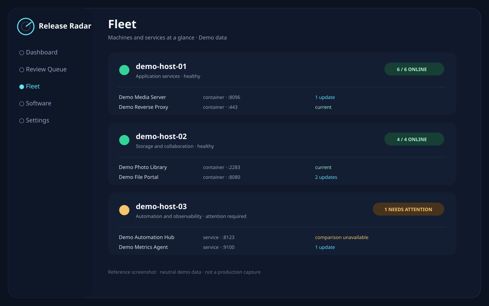
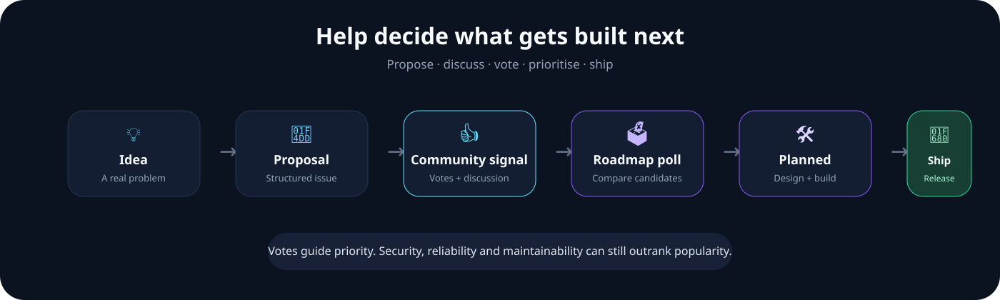
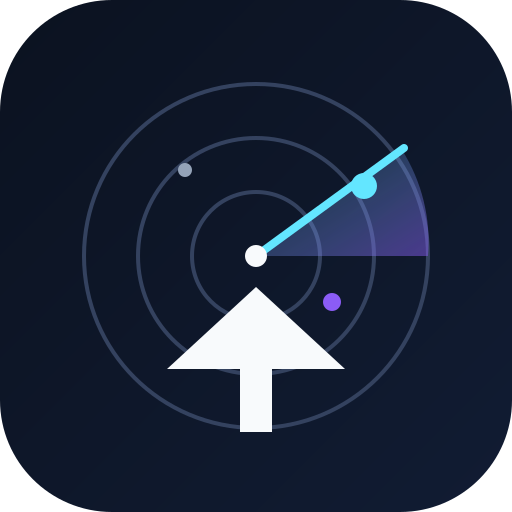

<p align="center">
  
</p>

<p align="center">
  
  
  
  
  
</p>

<p align="center">
  <a href="#-quick-start">Quick start</a> ·
  <a href="#-preview">Preview</a> ·
  <a href="#-what-it-does">Features</a> ·
  <a href="#-how-monitoring-works">Monitoring</a> ·
  <a href="#-production-readiness">Readiness</a> ·
  <a href="ROADMAP.md">Roadmap</a> ·
  <a href="CHANGELOG.md">Changelog</a> ·
  <a href="#-support-the-project">Support</a>
</p>

> [!IMPORTANT]
> **v2.7.0 is the first public release of Software Release Radar.** The application, Docker lifecycle, backup and restore path, automated monitoring, dependency audit, static security gate and clean macOS installation were validated before publication.

# 📡 What is Software Release Radar?

Software Release Radar is a self-hosted dashboard for people who run a growing collection of software and want a better way to keep track of updates.

It checks upstream releases, compares them with the versions you run, adds machine and service context, and gives you one place to decide what should be updated, delayed, ignored or investigated.

<table>
<tr>
<td width="33%" valign="top">

### 🐍 Python application

The application is written in Python 3.13 and served through Gunicorn.

</td>
<td width="33%" valign="top">

### 🐳 Docker deployment

Docker Compose is the primary deployment path. Host Python is not required for the recommended first run.

</td>
<td width="33%" valign="top">

### 🧠 AI is optional

Core monitoring is deterministic. AI can help interpret release notes when wanted.

</td>
</tr>
</table>

---

# 🧒 ELI5

Imagine you run 20 or 30 apps at home, in a homelab, or on your own servers.

Each app gets updates at different times. Without a tool like this, you may need to visit several websites, remember what version you installed, read release notes, work out which server runs each app, and decide whether the update is worth doing.

**Software Release Radar handles the repetitive tracking so you can focus on the decision.**

```text
Software you run
       │
       ▼
Check official upstream releases
       │
       ▼
Compare latest version with your version
       │
       ▼
Add machine, container and health context
       │
       ▼
Put the result in one review queue
       │
       ├── Update
       ├── Wait
       ├── Ignore
       └── Investigate
```

> [!NOTE]
> Release Radar is not an unattended production updater. It is designed to improve the information available before you make a change.

---

# 🚀 Quick start

### Requirements

- Docker Engine or Docker Desktop
- Docker Compose v2
- Git

### Install

```bash
git clone https://github.com/muhdusama/Software-Release-Radar.git
cd Software-Release-Radar
bash scripts/setup.sh
```

The setup helper asks for the first administrator account, generates secure application secrets inside a temporary Docker container, writes a protected `.env`, builds the stack, starts all services and waits for the application to report healthy.

Then open:

```text
http://localhost:9120
```

The administrator password itself is not written to `.env`.

Read **[docs/DOCKER.md](docs/DOCKER.md)** before exposing Release Radar beyond a trusted network.

---

# 🖼️ Preview

The following visuals use neutral demo data and contain no private production information.

### Dashboard

<p align="center">
  
</p>

### Review queue

<p align="center">
  
</p>

### Fleet

<p align="center">
  
</p>

---

# ✨ What it does

| Area | Capability |
|---|---|
| 📡 **Release tracking** | GitHub releases, prereleases and latest tags |
| ⏱️ **Automatic monitoring** | Scheduler checks only trackers whose individual refresh interval is due |
| 🔢 **Version awareness** | Installed, detected and upstream version comparison |
| 🖥️ **Fleet inventory** | Machine, service, container, port and health context |
| 🐳 **Portainer** | Inventory synchronisation and resilient container rebinding |
| ✅ **Review workflow** | Update, Wait, Ignore, Deployed and Needs Attention decisions |
| 🩺 **Diagnostics** | Separates real updates from checker failures and unavailable comparisons |
| 🔔 **Notifications** | SMTP email and Pushover delivery |
| 🧠 **Optional AI** | OpenAI-compatible release comparison and tracker chat |
| 👥 **Multi-user** | Administrator and standard-user roles |
| 💾 **Data safety** | SQLite WAL mode, online backup helper and guarded restore helper |
| 📦 **Deployment** | Docker Compose with persistent state |

### 📡 Release intelligence

- Track stable releases, prereleases or latest tags.
- Set a refresh interval per software package.
- Compare upstream releases with installed or detected versions.
- Keep checker failures separate from confirmed updates.
- Handle version schemes that need deterministic normalisation.

### 🖥️ Fleet context

- Associate software with machines and services.
- Record host, port, health and Docker container context.
- Group services by machine.
- Surface online, offline, update and needs-attention states.
- Search and filter larger inventories.

### ✅ Upgrade decisions

Release Radar provides an operational review queue rather than an unattended updater. A release can carry priority, risk, maintenance timing, notes, rollback context and deployment history.

### 🧠 Optional Release Assistant

An OpenAI-compatible endpoint can be used for release-note analysis and tracker chat. Core release checking, scheduling, probing, version comparison and standard notifications do not require an AI model.

---

# ⏱️ How monitoring works

The standard Docker stack contains three long-running services:

```text
Browser
   │
   ▼
Web application ───────────────┐
   │                           │
   ├── SQLite state            │
   ├── GitHub release API      │ shared application data
   ├── optional Portainer      │
   └── optional AI             │
                               │
Scheduler ─────────────────────┤
   │                           │
   └── checks due trackers     │
                               │
Portainer worker ──────────────┘
       └── background inventory jobs
```

The scheduler wakes every 60 seconds by default. It does not check every tracker every minute. Each tracker keeps its own refresh interval, and only due trackers are checked.

Automatic monitoring therefore works out of the box without an external cron job.

---

# 💾 Back up and restore

Create a verified online SQLite backup:

```bash
./scripts/backup.sh
```

Restore a verified backup:

```bash
bash scripts/restore.sh ./backups/radar-YYYYMMDD-HHMMSS.db --confirm
```

The backup helper uses SQLite's online backup API and runs `PRAGMA integrity_check`.

The restore helper validates the requested backup, creates a fresh pre-restore safety backup, stops database writers, restores through a narrowly scoped maintenance container, returns ownership to the non-root application user, validates the restored database and confirms that the full stack returns healthy.

See **[docs/DOCKER.md](docs/DOCKER.md)** for the full operational procedure.

---

# 🔐 Security model

The v2.7.0 baseline includes:

- CSRF protection on state-changing browser routes;
- HTTP-only, same-site session cookies;
- optional secure-only session cookies for HTTPS deployments;
- generated application secrets;
- Fernet encryption for stored integration secrets;
- shared login and password-reset throttling;
- security response headers;
- TLS verification enabled by default for Portainer;
- proxy forwarding headers disabled unless explicitly enabled;
- OpenAI-compatible endpoints restricted to complete HTTP or HTTPS URLs without embedded credentials;
- a non-root application container user;
- strict SSH host-key checking for optional Docker probes;
- fixed remote Docker inspection rather than arbitrary remote shell execution;
- blocking dependency vulnerability auditing with `pip-audit`; and
- a reviewed Bandit static-analysis gate in CI.

Security vulnerabilities should not be posted in public issues. Follow **[SECURITY.md](SECURITY.md)**.

For production hardening guidance, see **[docs/SECURITY-HARDENING.md](docs/SECURITY-HARDENING.md)**.

---

# 🧪 Production readiness

The release candidate is tested as a complete lifecycle, not only as a Docker image build.

| Gate | v2.7.0 status |
|---|---|
| Python compilation and complete automated test suite | ✅ Passed |
| Dependency vulnerability audit | ✅ Passed |
| Reviewed Bandit security gate | ✅ Passed |
| Real public first-run setup on a clean Linux runner | ✅ Passed |
| Web health and login-page acceptance | ✅ Passed |
| Automatic scheduler remains running | ✅ Passed |
| Portainer worker remains running | ✅ Passed |
| Online SQLite backup and integrity check | ✅ Passed |
| Guarded restore and return to healthy state | ✅ Passed |
| Persistent state after Compose restart | ✅ Passed |
| Clean macOS Docker Desktop acceptance | ✅ Passed |
| Visual review of clean deployment | ✅ Passed |
| Final privacy and secret scan after version freeze | ✅ Passed |
| Clean public Git root | ✅ Passed |
| GitHub safety settings and final launch review | ✅ Passed |

The public release is published from a sanitised clean Git history, and the same automated lifecycle gates continue to run on repository changes.

See **[ROADMAP.md](ROADMAP.md)** for the final launch checklist.

---

# 🎛️ Vibe-coded and open about it

Software Release Radar is very much a **vibe-coded project**.

I am not a software developer. I started building this because I had a practical problem in my own self-hosted setup and wanted a better way to solve it.

I have used **OpenAI Codex heavily** to help design, write, refactor, test and document the project. I set the direction, decide what the application should do, test it in a real environment, review the results and make the final call on changes.

I am being open about this because contributors should know how the project came together. There may be places where an experienced developer would choose a cleaner pattern or spot something that I missed. If you find one, please open an issue or pull request.

<table>
<tr>
<td width="33%" valign="top">

### 🧭 Human direction

Product decisions, priorities and release decisions stay human-led.

</td>
<td width="33%" valign="top">

### 🤖 Codex-assisted

Codex has been used extensively for implementation, testing, refactoring and documentation.

</td>
<td width="33%" valign="top">

### 🧪 Validation matters

AI-generated code is not treated as reviewed simply because a tool produced it. Tests and release gates still apply.

</td>
</tr>
</table>

---

# 👥 Contributors

<p align="center">
  
  
</p>

| Contributor | Role |
|---|---|
| [@muhdusama](https://github.com/muhdusama) | Creator and maintainer. Product direction, feature decisions, real-world testing and release decisions. |
| **OpenAI Codex** | AI coding contributor. Implementation, refactoring, tests, debugging, documentation and code review assistance. |

Codex is an AI coding tool rather than a conventional GitHub contributor account. GitHub's contributor graph is based on commit authorship, so Codex may not appear there as a separate account.

See **[CONTRIBUTORS.md](CONTRIBUTORS.md)** for more detail.

---

# 🗳️ Help shape the roadmap

<p align="center">
  
</p>

Once the repository is public:

1. propose a feature using the structured feature request form;
2. vote with a 👍 reaction on requests that would help you;
3. strong candidates can move into a roadmap poll for direct comparison; and
4. results help guide priority alongside security, reliability and maintenance effort.

<p align="center">
  <a href="FEATURE_VOTING.md"><strong>📊 Read how feature voting works</strong></a>
  &nbsp;&nbsp;•&nbsp;&nbsp;
  <a href="ROADMAP.md"><strong>🗺️ View the roadmap</strong></a>
</p>

---

# 🔓 Open-source licence

Software Release Radar is licensed under the **GNU Affero General Public License v3.0 (`AGPL-3.0`)**.

AGPL-3.0 permits use, modification, distribution and commercial use while applying strong copyleft requirements. Covered modifications and derivative works must remain under AGPL-3.0. If a modified version is provided to users over a network, those users must be offered access to the corresponding source code under the licence.

- [Full licence](LICENSE)
- [Commercial use and AGPL obligations](COMMERCIAL_USE.md)
- [Security policy](SECURITY.md)
- [Contribution guide](CONTRIBUTING.md)

---

# ☕ Support the project

Software Release Radar is a side project I am building and maintaining while I look for my next role. If it saves you time or is useful in your environment, any support is appreciated and helps me keep improving it.

<p align="center">
  <a href="https://buymeacoffee.com/muhdusama"></a>
  <a href="https://www.paypal.com/paypalme/muhdusama"></a>
</p>

Financial support is optional. The project remains available under its open-source licence either way.

---

# 📚 Documentation

| | Document | What it is for |
|---|---|---|
| 🐳 | [Docker deployment](docs/DOCKER.md) | Install, back up, restore, upgrade and troubleshoot |
| ⚙️ | [Configuration](docs/CONFIGURATION.md) | Environment variables and optional integrations |
| 🏗️ | [Architecture](docs/ARCHITECTURE.md) | Runtime services, data flow and design boundaries |
| 🔐 | [Security hardening](docs/SECURITY-HARDENING.md) | Production deployment checklist |
| 🗺️ | [Roadmap](ROADMAP.md) | Launch gates and future direction |
| 📜 | [Changelog](CHANGELOG.md) | Release history |
| 🗳️ | [Feature voting](FEATURE_VOTING.md) | How feature requests and roadmap polls work |
| 🤝 | [Contributing](CONTRIBUTING.md) | Contribution and validation workflow |
| 🛡️ | [Security policy](SECURITY.md) | How to report vulnerabilities |
| ☕ | [Support](SUPPORT.md) | Project support and funding options |

---

<p align="center">
  
</p>

<p align="center"><strong>Track releases. Compare versions. Know what changed.</strong></p>
