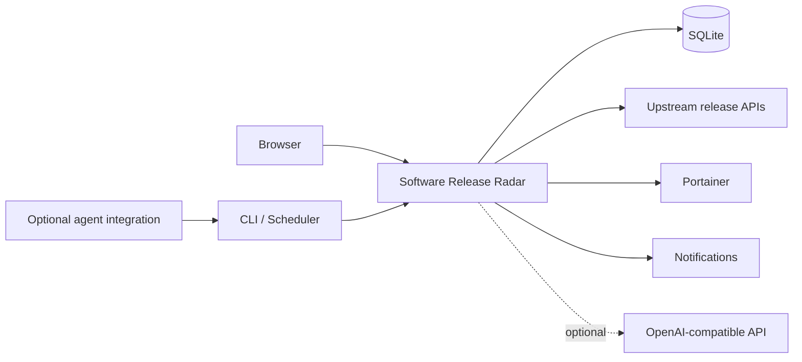

<p align="center">
  
</p>

<p align="center">
  
  
  
  
  
</p>

<p align="center">
  <a href="#eli5">ELI5</a> ·
  <a href="#preview">Preview</a> ·
  <a href="#what-it-does">Features</a> ·
  <a href="ROADMAP.md">Roadmap</a> ·
  <a href="CHANGELOG.md">Changelog</a> ·
  <a href="CONTRIBUTING.md">Contributing</a> ·
  <a href="#support-the-project">Support</a>
</p>

> [!CAUTION]
> **PRIVATE PUBLICATION STAGING REPOSITORY.** This repository is not ready to make public yet. The sanitised v2.6.3 application source still needs to be imported and pass the final privacy, secret, build and clean-install audits. The branding and screenshots below are public-safe reference visuals using neutral demo data.

Software Release Radar is a **self-hosted release monitoring and upgrade-review dashboard**. It watches the software you run, checks upstream releases, compares versions, adds deployment context and gives you a review queue so you can decide what to update—and why.

## At a glance

| | |
|---|---|
| **Problem** | Keeping track of updates across a growing self-hosted fleet is tedious and error-prone. |
| **Solution** | One place to see upstream releases, installed versions, health context and update decisions. |
| **Deployment** | Self-hosted with Docker Compose. |
| **Core monitoring** | Deterministic; no LLM required. |
| **AI** | Optional, for interpreting release notes and answering release questions. |
| **Licence** | GNU AGPL-3.0 strong copyleft open source. |
| **Current baseline** | v2.6.3, being prepared for the first public source release. |

---

## ELI5

Imagine you run a bunch of apps at home or on your own servers.

Every app releases updates at different times. Normally you have to visit lots of websites, work out which version you already have, read release notes, remember which server runs what, and decide whether an update is safe.

**Software Release Radar does the boring tracking part for you.**

```text
Your software
     │
     ▼
Check official upstream releases
     │
     ▼
Compare latest version with what you run
     │
     ▼
Add machine, container and health context
     │
     ▼
Show one review queue
     │
     ├── Update
     ├── Wait
     ├── Ignore
     └── Investigate
```

It is **not designed to blindly update production systems**. It helps you make better update decisions while keeping you in control.

---

## Preview

> These are **reference visuals generated with neutral demo data**, not captures of the private production environment. Final screenshots will be regenerated from the sanitised public build before launch.

### Dashboard

<p align="center">
  
</p>

| Review queue | Fleet view |
|---|---|
|  |  |

---

## Why Software Release Radar?

A version number by itself does not answer the questions that matter:

- Is the installed version genuinely behind?
- Is the upstream release stable, prerelease or only a tag?
- Which machine, service or container is affected?
- Is that service currently healthy?
- What actually changed in the new release?
- Is this an update, a checker failure, or simply missing upstream information?
- Should the update happen now, later, or not at all?
- What rollback or maintenance context should be retained?

Software Release Radar brings those questions into one operational view.

---

## What it does

| Area | Capability |
|---|---|
| **Release tracking** | GitHub releases, prereleases and latest tags |
| **Version awareness** | Installed, detected and upstream version comparison |
| **Fleet inventory** | Machine, service, container, port and health context |
| **Portainer** | Inventory sync and resilient container rebinding |
| **Review workflow** | Update, Wait, Ignore, Deployed and needs-attention decisions |
| **Diagnostics** | Separates real updates from checker failures and unavailable comparisons |
| **Notifications** | SMTP email, Pushover and Matrix-compatible delivery |
| **Optional AI** | OpenAI-compatible release comparison and tracker chat |
| **Multi-user** | Administrator and standard-user roles |
| **Operations** | CLI status, due checks, probes and deterministic smoke tests |
| **Deployment** | Docker Compose with persistent state |

### Release intelligence

- Track stable releases, prereleases or latest tags.
- Use per-software refresh intervals.
- Compare upstream releases with installed or detected versions.
- Keep checker failures and unavailable comparisons separate from confirmed updates.
- Handle version schemes that need deterministic normalisation.

### Fleet and deployment context

- Associate software with machines and services.
- Record host, port, health and Docker-container context.
- Group services by machine.
- Surface online, offline, update and needs-attention states.
- Search and filter larger inventories.

### Upgrade decisions

Software Release Radar provides an **operational review queue**, not an unattended updater. Releases can carry decision state, priority, risk, maintenance timing, notes, rollback context and deployment history.

### Optional Release Assistant

An OpenAI-compatible endpoint can be configured for release-note analysis and tracker chat. Core release checking, scheduling, probing, version comparison and ordinary notification workflows do **not** require an AI model.

---

## Architecture



The design principle is simple: **automation should be deterministic by default; AI should assist with interpretation, not be required for basic monitoring.**

---

## Project direction

The project is currently moving from a private production application to a public open-source project.

**Current priorities:**

1. sanitise and import the v2.6.3 source;
2. prove a clean self-hosted install from scratch;
3. add CI, dependency and security checks;
4. finish public installation/configuration documentation;
5. regenerate screenshots from the sanitised build; and
6. complete the final publication audit before changing repository visibility.

See the full **[Roadmap](ROADMAP.md)** for what comes next and **[Changelog](CHANGELOG.md)** for release history.

---

## Open-source licence

Software Release Radar is licensed under the **GNU Affero General Public License v3.0 (`AGPL-3.0`)**.

AGPL-3.0 permits use, modification, distribution and commercial use, while applying strong copyleft requirements. Covered modifications and derivative works must remain under AGPL-3.0, and users interacting with a modified version over a network must be offered access to its corresponding source code under the licence.

You may not add restrictions that remove rights granted by AGPL-3.0.

- [Full licence](LICENSE)
- [Commercial use and AGPL obligations](COMMERCIAL_USE.md)
- [Security policy](SECURITY.md)
- [Contribution guide](CONTRIBUTING.md)

---

## Data and privacy

Runtime state belongs in the deployment, **not in Git**.

Never commit or publish:

- `.env` files containing secrets;
- SQLite/runtime databases;
- API tokens or credentials;
- SSH private keys;
- backups or candidate deployment directories;
- private infrastructure logs;
- private DNS names or internal addresses; or
- screenshots containing real private infrastructure data.

The first public Git history will be based on a sanitised source snapshot rather than importing the historical private repository wholesale.

---

## Support the project

Software Release Radar is a side project I’m building and maintaining while looking for my next role. If the project saves you time or is useful in your environment, any support is appreciated and helps me keep improving it.

<p align="center">
  <a href="https://buymeacoffee.com/muhdusama"></a>
  <a href="https://www.paypal.com/paypalme/muhdusama"></a>
</p>

Support is entirely optional. The project remains available under its open-source licence regardless of financial support.

See [SUPPORT.md](SUPPORT.md) for project support channels.

---

## Repository guide

| Document | Purpose |
|---|---|
| [CHANGELOG.md](CHANGELOG.md) | What changed between releases |
| [ROADMAP.md](ROADMAP.md) | What is being worked on and considered next |
| [CONTRIBUTING.md](CONTRIBUTING.md) | How to contribute |
| [SECURITY.md](SECURITY.md) | How to report vulnerabilities safely |
| [SUPPORT.md](SUPPORT.md) | Usage support and project-support links |
| [COMMERCIAL_USE.md](COMMERCIAL_USE.md) | Plain-language AGPL commercial-use guidance |
| [LICENSE](LICENSE) | Governing AGPL-3.0 licence text |

Detailed installation, configuration and architecture documentation will be staged alongside the sanitised application source so those instructions are validated against the actual public build rather than guessed in advance.

---

<p align="center">
  
</p>

<p align="center"><strong>Track releases. Compare versions. Know what changed.</strong></p>
