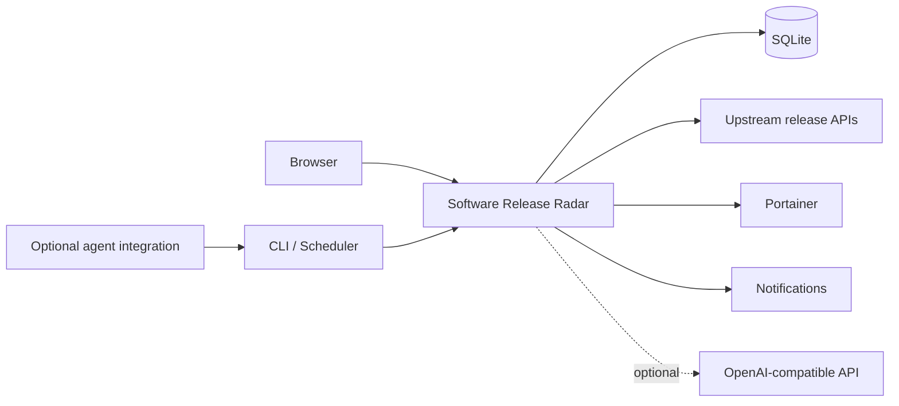
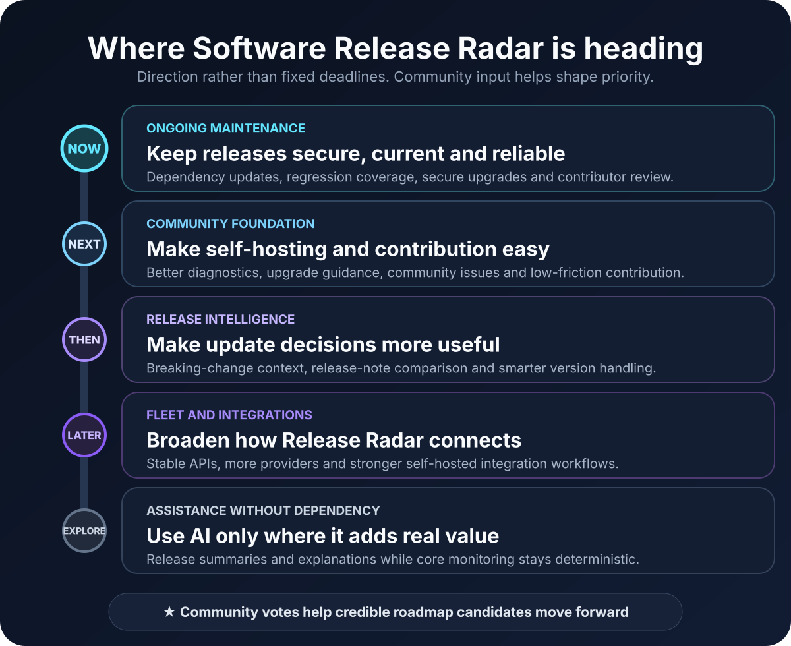

<p align="center">
  
</p>

<p align="center">
  
  
  
  
  
</p>

<p align="center">
  <a href="#-eli5">ELI5</a> ·
  <a href="#-preview">Preview</a> ·
  <a href="#-what-it-does">Features</a> ·
  <a href="#-python-app-docker-deployment">Deployment</a> ·
  <a href="#-help-shape-the-roadmap">Vote</a> ·
  <a href="ROADMAP.md">Roadmap</a> ·
  <a href="CHANGELOG.md">Changelog</a> ·
  <a href="#-support-the-project">Support</a>
</p>

> [!CAUTION]
> **Private publication staging repository.** The public release is still being prepared. The sanitised v2.6.3 source needs to be imported and pass privacy, secret, build and clean-install checks before this repository is made public. The visuals in this repository use neutral demo data.

# 📡 What is Software Release Radar?

Software Release Radar is a self-hosted dashboard for people who run a growing collection of software and want a better way to keep track of updates.

It checks upstream releases, compares them with the versions you run, adds machine and service context, and gives you one place to decide what should be updated, delayed, ignored or investigated.

<table>
<tr>
<td width="33%" valign="top">

### 🐍 Python application

The application itself is written in Python 3.13.

</td>
<td width="33%" valign="top">

### 🐳 Docker deployment

Docker Compose is the intended primary deployment method for the public release.

</td>
<td width="33%" valign="top">

### 🧠 AI is optional

Core monitoring works without an LLM. AI can help interpret release notes when wanted.

</td>
</tr>
</table>

---

# 🧒 ELI5

Imagine you run 20 or 30 apps at home, in a homelab, or on your own servers.

Each app gets updates at different times. Without a tool like this, you may need to visit several websites, remember what version you installed, read release notes, work out which server runs each app, and then decide whether the update is worth doing.

**Software Release Radar handles the repetitive tracking so you can focus on the decision.**

```text
Software you run
       │
       ▼
Check official upstream releases
       │
       ▼
Compare latest version with your version
       │
       ▼
Add machine, container and health context
       │
       ▼
Put the result in one review queue
       │
       ├── Update
       ├── Wait
       ├── Ignore
       └── Investigate
```

> [!IMPORTANT]
> Release Radar is not meant to blindly update production systems. The point is to give you better information before you make the change.

---

# 🖼️ Preview

> These are reference visuals built with neutral demo data. They are not captures of the private production environment. Final screenshots will be taken from the sanitised public build before launch.

### Dashboard

<p align="center">
  
</p>

| Review queue | Fleet view |
|---|---|
|  |  |

---

# 🎯 Why I built it

Once a self-hosted environment grows beyond a handful of services, update tracking becomes surprisingly messy.

A version number alone does not tell you enough. I wanted one place that could answer questions such as:

| Question | Why it matters |
|---|---|
| **Am I actually behind?** | A failed checker should not look like a confirmed update. |
| **What changed?** | A patch release and a breaking release should not be treated the same way. |
| **Where does this run?** | Machine, service and container context matters during maintenance. |
| **Is the service healthy now?** | Updating an already unhealthy service can make troubleshooting harder. |
| **Should I update today?** | Some releases should be applied quickly. Others are better left for later. |
| **What did I decide last time?** | Release history and deployment notes are useful when something goes wrong. |

---

# ✨ What it does

| Area | Capability |
|---|---|
| 📡 **Release tracking** | GitHub releases, prereleases and latest tags |
| 🔢 **Version awareness** | Installed, detected and upstream version comparison |
| 🖥️ **Fleet inventory** | Machine, service, container, port and health context |
| 🐳 **Portainer** | Inventory synchronisation and resilient container rebinding |
| ✅ **Review workflow** | Update, Wait, Ignore, Deployed and Needs Attention decisions |
| 🩺 **Diagnostics** | Separates real updates from checker failures and unavailable comparisons |
| 🔔 **Notifications** | SMTP email, Pushover and Matrix-compatible delivery |
| 🧠 **Optional AI** | OpenAI-compatible release comparison and tracker chat |
| 👥 **Multi-user** | Administrator and standard-user roles |
| 🛠️ **Operations** | CLI status, due checks, probes and deterministic smoke tests |
| 📦 **Deployment** | Docker Compose with persistent state |

### 📡 Release intelligence

- Track stable releases, prereleases or latest tags.
- Set a refresh interval per software package.
- Compare upstream releases with installed or detected versions.
- Keep checker failures separate from confirmed updates.
- Handle version schemes that need deterministic normalisation.

### 🖥️ Fleet context

- Associate software with machines and services.
- Record host, port, health and Docker container context.
- Group services by machine.
- Surface online, offline, update and needs-attention states.
- Search and filter larger inventories.

### ✅ Upgrade decisions

Release Radar provides an operational review queue rather than an unattended updater. A release can carry priority, risk, maintenance timing, notes, rollback context and deployment history.

### 🧠 Optional Release Assistant

An OpenAI-compatible endpoint can be used for release-note analysis and tracker chat. Core release checking, scheduling, probing, version comparison and normal notifications do not require an AI model.

---

# 🐍 Python app, Docker deployment

The two labels describe different parts of the project:

```text
Python 3.13
   │
   │ application code
   ▼
Software Release Radar
   │
   │ packaged and run with
   ▼
Docker + Docker Compose
```

The public release is being prepared with **Docker Compose as the main supported installation path**. The goal is a simple, repeatable setup with persistent data, an example environment file and clear upgrade instructions.

### Public release deployment target

```text
git clone repository
        │
        ▼
copy .env.example to .env
        │
        ▼
docker compose up -d
        │
        ▼
open Release Radar in your browser
```

The exact commands will be added after the sanitised source and Compose files pass a clean-machine installation test.

---

# 🏗️ Architecture



**Design rule:** deterministic automation first. AI is used for interpretation where it adds value, not as a requirement for basic monitoring.

---

# 🗳️ Help shape the roadmap

<p align="center">
  
</p>

I want the roadmap to reflect real problems that people are trying to solve.

Once the repository is public, feature requests will use a simple community voting process:

1. **Propose a feature** using the structured feature request form.
2. **Vote with a 👍 reaction** on requests that would help you.
3. Strong candidates can move into a **roadmap poll** for direct comparison.
4. Results help guide priority alongside security, reliability and maintenance effort.

<p align="center">
  <a href="FEATURE_VOTING.md"><strong>📊 Read how feature voting works</strong></a>
  &nbsp;&nbsp;•&nbsp;&nbsp;
  <a href="ROADMAP.md"><strong>🗺️ View the roadmap</strong></a>
</p>

GitHub Discussions polls are planned for the public repository. Issues and 👍 reactions will remain useful for detailed proposals and long-term demand signals.

---

# 🗺️ Where the project is heading

<p align="center">
  
</p>

The immediate job is to turn the existing v2.6.3 private production application into a clean public project that another person can install without knowing anything about the original environment.

**Current priorities:**

- 🧹 sanitise and import the v2.6.3 source;
- 🐳 validate Docker Compose deployment from a clean machine;
- 🔐 add privacy, secret and dependency checks;
- 🧪 add CI and regression tests;
- 📚 finish public installation and configuration documentation;
- 📸 replace reference images with screenshots from the sanitised build; and
- 🚀 complete the publication audit before changing repository visibility.

See the full **[Roadmap](ROADMAP.md)** and **[Changelog](CHANGELOG.md)**.

---

# ⭐ Help people find the project

If Release Radar is useful to you, a GitHub star is a simple way to support the project. Stars also help other self-hosters discover useful projects through GitHub search and Explore.

When the repository is public, I will also use GitHub topics, Discussions, releases and a proper social preview so the project is easier to find and understand.

---

# 🔓 Open-source licence

Software Release Radar is licensed under the **GNU Affero General Public License v3.0 (`AGPL-3.0`)**.

AGPL-3.0 permits use, modification, distribution and commercial use while applying strong copyleft requirements. Covered modifications and derivative works must remain under AGPL-3.0. If a modified version is provided to users over a network, those users must be offered access to the corresponding source code under the licence.

- [Full licence](LICENSE)
- [Commercial use and AGPL obligations](COMMERCIAL_USE.md)
- [Security policy](SECURITY.md)
- [Contribution guide](CONTRIBUTING.md)

---

# 🔐 Data and privacy

Runtime state belongs in the deployment, not in Git.

Never commit or publish:

- `.env` files containing secrets;
- SQLite or runtime databases;
- API tokens or credentials;
- SSH private keys;
- backups or candidate deployment directories;
- private infrastructure logs;
- private DNS names or internal addresses; or
- screenshots containing real private infrastructure data.

The first public Git history will use a sanitised source snapshot instead of importing the historical private repository wholesale.

---

# ☕ Support the project

Software Release Radar is a side project I am building and maintaining while I look for my next role. If it saves you time or is useful in your environment, any support is appreciated and helps me keep improving it.

<p align="center">
  <a href="https://buymeacoffee.com/muhdusama"></a>
  <a href="https://www.paypal.com/paypalme/muhdusama"></a>
</p>

Financial support is optional. The project remains available under its open-source licence either way.

---

# 📚 Project links

| | Document | What it is for |
|---|---|---|
| 🗺️ | [ROADMAP.md](ROADMAP.md) | Current priorities and future direction |
| 📊 | [FEATURE_VOTING.md](FEATURE_VOTING.md) | How community feature voting works |
| 📝 | [CHANGELOG.md](CHANGELOG.md) | Release history and notable changes |
| 🤝 | [CONTRIBUTING.md](CONTRIBUTING.md) | Contribution guidelines |
| 🔐 | [SECURITY.md](SECURITY.md) | Responsible vulnerability reporting |
| 💬 | [SUPPORT.md](SUPPORT.md) | Support channels and project support |
| ⚖️ | [COMMERCIAL_USE.md](COMMERCIAL_USE.md) | Plain-language AGPL guidance |
| 📄 | [LICENSE](LICENSE) | Full AGPL-3.0 licence text |

Detailed installation, configuration and architecture guides will be staged with the sanitised source so the instructions can be tested against the real public build.

---

<p align="center">
  
</p>

<p align="center"><strong>Track releases. Compare versions. Know what changed.</strong></p>
