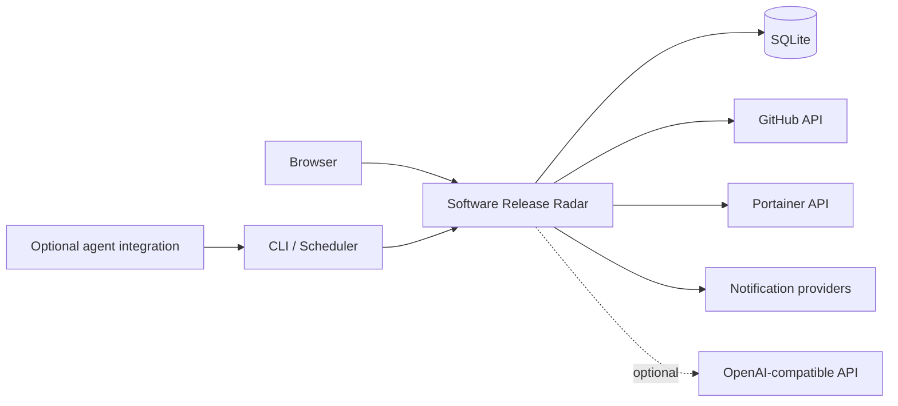

# Software Release Radar

> [!CAUTION]
> **PRIVATE PUBLICATION STAGING REPOSITORY** — this repository is not yet ready to make public. The application source has not yet been imported from the authoritative private Gitea v2.6.3 snapshot, and the final privacy/security/source audit is still pending.

**Track releases. Compare versions. Know what changed.**

   

> [!IMPORTANT]
> Software Release Radar is **source-available for noncommercial use**. It is not OSI-approved open-source software because commercial use is intentionally restricted. See [Licensing](#licensing).

Software Release Radar is a self-hosted dashboard for monitoring upstream software releases, comparing them with deployed versions, and turning release information into an operational review queue.

It is designed for homelabs, personal infrastructure, research environments, educational use and other permitted noncommercial deployments.

## Why Software Release Radar?

Release monitoring gets difficult when a fleet grows. A version number alone does not answer the questions that matter:

- Is the installed version actually behind?
- Is the upstream release stable, prerelease, or only a tag?
- Which machine or container is affected?
- Is the deployed service currently healthy?
- What changed in the new release?
- Should the update happen now, later, or be ignored?
- What rollback context should be retained?

Software Release Radar brings those questions into one place while keeping monitoring deterministic. Optional AI-assisted analysis is separate from the core release-checking path.

## Highlights

| Area | Capability |
|---|---|
| Release tracking | GitHub releases, prereleases and latest tags |
| Version awareness | Installed, detected and upstream version comparison |
| Fleet inventory | Machine, service, container, port and health context |
| Portainer | Inventory sync and resilient container mapping |
| Review workflow | Review, Update, Wait, Ignore and Deployed decisions |
| Notifications | SMTP email, Pushover and Matrix-compatible delivery |
| Optional AI | OpenAI-compatible release comparison and tracker chat |
| Multi-user | Administrator and standard-user roles |
| Operations | CLI status, due checks, probes and deterministic smoke tests |
| Deployment | Docker Compose with persistent bind-mounted state |

## Architecture

The release-checking path does not require an LLM. AI analysis is an optional enhancement for interpreting release notes and answering questions.

## Main capabilities

### Release intelligence

- Track stable GitHub releases, prereleases or latest tags.
- Use per-software refresh intervals.
- Compare upstream releases with installed or detected versions.
- Keep checker failures and unavailable comparisons separate from confirmed updates.
- Handle version schemes that need deterministic normalization.

### Fleet and deployment context

- Associate software with machines and services.
- Record host, port, health and Docker-container context.
- Group services by machine in the fleet view.
- Surface online, offline, update and needs-attention states.
- Search and filter large inventories.

### Portainer integration

- Import and synchronise Docker inventory from Portainer.
- Preserve explicit tracker-to-service mappings.
- Recover safely from container recreation when endpoint, container name and repository match.
- Prevent unrelated or cross-endpoint services from taking over an existing mapping.

### Upgrade decisions

Software Release Radar provides an operational review queue rather than an unattended updater. Each release can carry decision state, priority and risk, maintenance timing, notes, rollback context and immutable deployment history.

### Notifications

Supported notification paths include SMTP email, Pushover and Matrix-compatible messaging. A deterministic notification smoke test is available so notification plumbing can be tested without invoking an AI model.

### Optional Release Assistant

An OpenAI-compatible endpoint can be configured for release-note analysis and tracker chat. This integration is optional; core monitoring, scheduling, probing, version comparison and notification checks remain usable without it.

## Data and privacy model

Runtime data belongs in the deployment's persistent state directories and **must not be committed to Git**. Never publish `.env`, SQLite databases, SSH keys, API tokens, backups, candidate deployment directories, private infrastructure logs or production screenshots.

## Documentation

- [Installation](docs/INSTALLATION.md)
- [Configuration](docs/CONFIGURATION.md)
- [Architecture](docs/ARCHITECTURE.md)
- [Security hardening](docs/SECURITY-HARDENING.md)
- [Contributing](CONTRIBUTING.md)
- [Support](SUPPORT.md)
- [Security policy](SECURITY.md)
- [Commercial-use policy](COMMERCIAL_USE.md)
- [Publication checklist](PUBLICATION-CHECKLIST.md)

## Project status

The intended first public-source baseline is **v2.6.3**. Before this repository becomes public, it must receive the sanitised application source, pass the complete privacy/secret audit, pass tests/builds from a clean environment, and receive final demo screenshots.

## Licensing

Software Release Radar is licensed under the **PolyForm Noncommercial License 1.0.0** (`PolyForm-Noncommercial-1.0.0`). Commercial use is not granted by the public licence.

Read [LICENSE](LICENSE) and [COMMERCIAL_USE.md](COMMERCIAL_USE.md) before using or redistributing the software.
