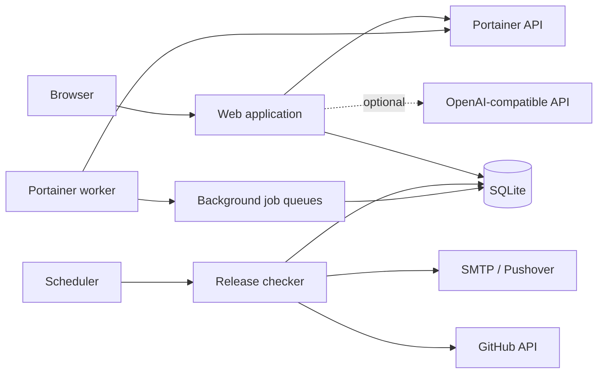

# Architecture

Software Release Radar is a Python 3.13 Flask application packaged for Docker Compose.

Its core release-monitoring path is deterministic. AI integration is optional and sits outside the basic checking, scheduling and version-comparison path.

## Runtime overview



## Containers

The default Compose deployment runs three containers from the same application image.

### `software-release-radar`

Runs the Flask application through Gunicorn.

Responsibilities include:

- authentication and user administration;
- tracker configuration;
- dashboards and fleet views;
- manual release checks and probes;
- upgrade decisions;
- application settings;
- Portainer job submission; and
- optional assistant interactions.

### `software-release-radar-scheduler`

Runs `python -m radar.scheduler`.

It wakes on a short polling interval and asks the checker for enabled trackers that are due according to their individual refresh interval.

New release events are then passed to the normal notification delivery path.

The scheduler does not require an LLM.

### `software-release-radar-portainer-worker`

Runs `python -m radar.portainer_worker`.

It handles queued Portainer synchronisation and bulk-import work outside the web request lifecycle. When there is no work, it sleeps.

## Shared state

All three containers share one named Docker volume containing SQLite state.

Default database path:

```text
/data/radar.db
```

SQLite is configured with:

- foreign keys enabled;
- WAL journal mode; and
- a 30-second busy timeout.

These settings support the modest multi-process concurrency expected from the web application and the two background workers.

## Core data flow

### New tracker

```text
User adds tracker
      │
      ▼
Validate GitHub repository
      │
      ▼
Save tracker
      │
      ▼
Fetch current upstream release
      │
      ▼
Store initial baseline
```

The initial baseline does not generate a new-release alert.

### Scheduled release check

```text
Scheduler cycle
      │
      ▼
Find enabled trackers that are due
      │
      ▼
Fetch upstream release information
      │
      ├── unchanged → update last-check status
      │
      └── changed → create release event
                        │
                        ▼
                 notification delivery
```

Checker failures are recorded separately from confirmed updates so a temporary API or parsing problem does not inflate the update queue.

## Version state

Release Radar keeps upstream and deployed state separate.

Important concepts include:

- upstream Git tag;
- upstream release name;
- manually entered installed version;
- automatically detected installed version; and
- classified tracker state such as current, update available or needs attention.

Version matching includes normalisation for projects whose release titles, Git tags or container labels do not use exactly the same format.

## Probes

Probes are optional and deterministic.

Supported modes include:

- manual/TCP reachability;
- HTTP automatic discovery;
- HTTP JSON path;
- HTTP regular expression;
- constrained SSH Docker inspection; and
- Portainer inventory.

A failed local service probe does not cause the upstream release check itself to be discarded.

## Portainer architecture

Portainer integration has two paths.

### Synchronous operations

The web application can test the configured Portainer connection and read inventory state.

### Background jobs

Larger synchronisation and import work is persisted to SQLite job tables. The Portainer worker claims queued work, updates progress and records completion or failure.

This avoids holding a browser request open during longer inventory jobs.

Tracker-to-container rebinding is deliberately conservative. An explicit mapping remains authoritative, and automatic rebinding requires enough matching context to avoid another container taking over an existing tracker.

## Notifications

Current public notification channels are:

- SMTP email; and
- Pushover.

Notification delivery is tracked per event, user and channel. Successful or deliberately skipped deliveries are not sent repeatedly.

Integration credentials are encrypted before they are stored in SQLite.

## Authentication

The web application uses local accounts stored in SQLite.

Security controls include:

- PBKDF2-SHA256 password hashing;
- CSRF tokens for state-changing browser requests;
- session invalidation when a user's password hash changes;
- HTTP-only and same-site cookies;
- optional secure-only cookies for HTTPS;
- SQLite-backed login throttling shared across Gunicorn workers;
- password-reset request throttling; and
- one-hour, single-use password reset tokens stored as SHA-256 digests.

## Reverse proxy trust

Forwarded proxy headers are ignored by default.

When `TRUST_PROXY_HEADERS=true`, Werkzeug `ProxyFix` trusts one directly connected proxy for the original address, scheme and host. This must only be enabled when untrusted clients cannot bypass that proxy and connect directly while supplying forged forwarding headers.

## Secrets

There are two categories of secrets.

### Deployment secrets

Stored in `.env`:

- Flask `SECRET_KEY`
- Fernet `ENCRYPTION_KEY`
- initial administrator password hash
- optional GitHub token

### Application integration secrets

Stored encrypted in SQLite:

- SMTP password
- Pushover application token
- user Pushover keys
- Portainer API token
- OpenAI-compatible API key

The Fernet key itself stays outside SQLite in `.env`.

## Optional AI path

The assistant uses an OpenAI-compatible Chat Completions API.

It can provide:

- release analysis;
- tracker-specific questions and answers; and
- optional automatic analysis when a new release is detected.

Release checking, due scheduling, probes and version classification do not depend on the AI path.

## Backup model

The application uses SQLite's online backup API rather than copying a live WAL database file directly.

The restore path validates the requested backup, creates a pre-restore safety backup, stops writers, restores the requested database, validates it, and attempts automatic rollback to the safety backup if restoration fails.

## Trust boundaries

Treat the following as untrusted input:

- GitHub release names and release notes;
- Portainer API responses and container metadata;
- remote HTTP probe responses;
- optional AI output; and
- user-entered tracker fields.

The application validates or escapes these inputs according to where they are used. New integrations should preserve this boundary rather than treating upstream metadata as trusted simply because it came from an API.
